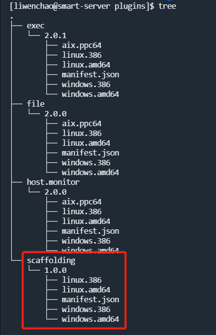

# scaffolding

smartagent插件脚手架项目

## 实现原理

1. 插件自身的日志通过stderr输出，输出过程中无需输出时间戳，agent会在每一行前增加日志捕获时间，日志输出可通过封装好的logging包进行输出
2. 插件需要返回的数据通过stdout进行输出，允许返回多次数据，输出格式如下，可通过utils包中的WriteMessage进行输出

        <length(4字节)><crc32(4字节)><payload>

## 开发方式

1. 拉取当前项目

        git clone https://github.com/jkstack/scaffolding.git
2. 删除.git目录

        rm -fr .git
3. 按github的操作手册，初始化git仓库

        git init
        git remote add origin <项目地址>
        git add .
        git commit -m "Initial commit"
        git push -u origin master
4. 修改build脚本和Makefile文件中的PROJ变量
5. 修改manifest.json中的name字段
6. 实现main.go中的msg对象处理函数
7. 修改`CHANGELOG.md`
8. 提交合并请求
9. 合并代码
10. 打包上线

## 基本接口

1. [WriteMessage](code/utils/msg.go): 输出anet.Msg结构的数据到stdout输出的数据将会被agent捕获并转发到server
2. [log输出](code/logging/log.go): 输出log信息到stderr输出的日志将会被agent捕获并记录到对应插件的日志文件
    - logging.Debug: 输出调试信息，为减少调试信息的内容将有1‰的内容将被输出
    - logging.Info: 输出标准日志
    - logging.Error: 输出错误日志，其中会包含出错时的调用堆栈信息
    - logging.Flush: 将缓存中的日志全部输出

## 如何调试

1. 使用make命令编译插件，编译结果将会输出到release目录下
2. 将release/1.0.0目录上传到server的plugins目录下，目录结构如下

3. 调用server的/plugin/reload接口加载新增插件

        curl http://192.168.3.147:13080/plugin/reload
4. 调用server的/scaffolding/foo接口触发该插件

        curl http://192.168.3.147:13080/scaffolding/foo?id=<agentid>